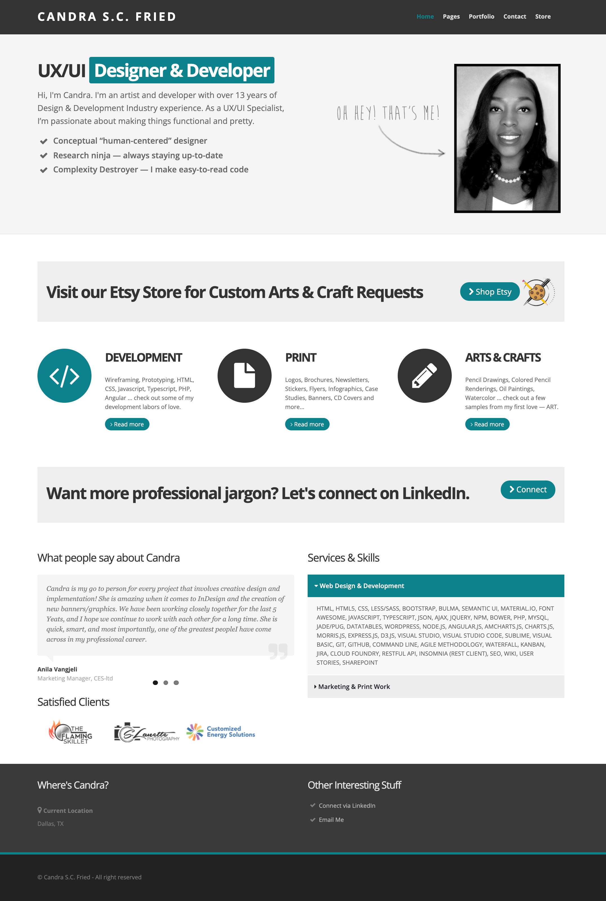

# Candra Fried Portfolio — version 1
The is an older portfolio from 2019 showcasing some of my professional and creative works. I'm proud of the work I was able to create, but my plan was always to revist this design to make it a bit more modern. At present, the images aren't optimized, and as a result... the site has a tendancy to load a bit slower. Nevertheless, this application got the job done for what I needed it for back in 2019: showcasing some samples of my work, getting my resume out there to the masses, and establishing on online footprint.

## Important & Relevent URLs

- [Deployed Application URL](https://candracodes.github.io/cfried-portfolio-v1/)
- [GitHub Repo URL](https://github.com/candracodes/cfried-portfolio-v1)
- [Resume](https://drive.google.com/file/d/1DQE7p5poFXvcVrIBnuNTejJkuoTIuxOj/view?usp=sharing)
- [LinkedIn](https://www.linkedin.com/in/candracook/ )

## Mock-Up

* This portfolio resembles the following screenshot:

## Frameworks & Libraries

The project is created using the following frameworks and libraries

- [Bootstrap v4.6](https://getbootstrap.com/docs/4.6/getting-started/introduction/)
- [FontAwesome — v5.8.1](https://fontawesome.com/v5.15/how-to-use/on-the-web/referencing-icons/basic-use)
- [jQuery — v3.2.1](https://api.jquery.com/)

## Licensing
The project is made possible with the following Licensing:
- [MIT](license.txt)